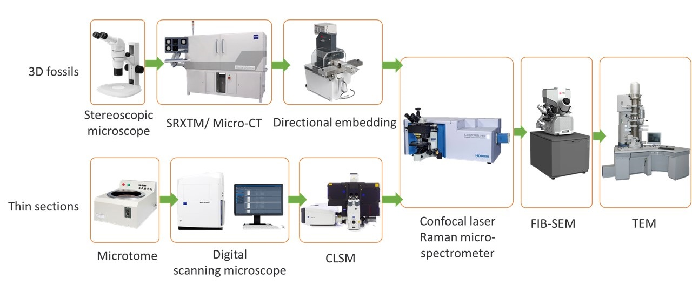
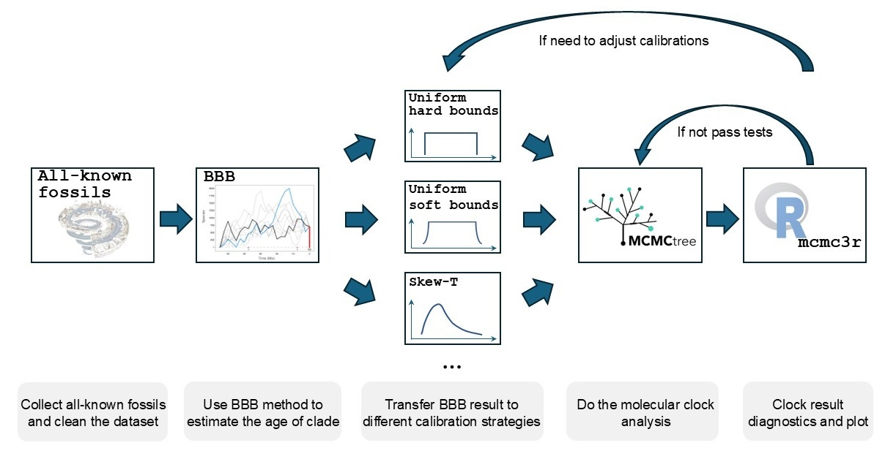

My academic journey began with a deep passion for palaeontology, from being captivated by the intricate beauty and diverse structures of fossils, to exploring their connections with extant species, and further investigating the origins and evolutionary relationships between organisms by reconstructing phylogenetic trees. I am now self-identified as an evolutionary paleobiologist, aspiring to systematically explore model-based interpretation of fossils using various Bayesian methods. Through this, I aim to gain deeper insights into tree dating, speciation and extinction events, and related topics of the evolutionary process.

Can I observe fossil better?

With a strong interest in the fossils and the early life, I earned my Master’s degree in Palaeontology and stratigraphy from [Nanjing Institute of Geology and Palaeontology, Chinese Academy of Sciences](http://english.nigpas.cas.cn/) (NIGPAS). During my studies, I focused on utilizing multiple techniques to better analyze fossils, aiming to gather comprehensive information from two-dimensional to three-dimensional imaging, across scales ranging from centimeters to micrometers, and from microscopy to spectroscopy. I published several papers on the application of laser confocal microscopy, Raman spectroscopy, and 3D X-ray imaging (micro-CT and synchrotron) to fossils of different taphonomic types. Based on those work, I completed my Master’s thesis in 2020.

<figure style="float: left; width: 800px; margin-left: 50px; margin-right: 20px;">  <!-- 使用 text-align: center 居中内容，margin: 0 auto 居中整个 figure 宽度 -->
      <!-- 图片宽度设置为 100%，保证在 500px 宽度内自适应 -->
    <figcaption style="text-align: center; font-size: 14px; color: gray; margin-top: 0.5em;margin-left: 100px; margin-right: 20px;">  <!-- 保证 caption 正常显示在图片下方 -->
        The multi-technique analysis project for better digging the information of fossil of all kinds.
    </figcaption>
</figure>

 <!--这段文字将会显示在图片的下方，不会再紧贴图片的右侧。-->

Can I figure out the relationships among clades better?

After starting my PhD of [Palaeobiology in University of Bristol](https://www.bristol.ac.uk/earthsciences/research/palaeobiology/), my research extended beyond fossils themselves and the observation techniques. Building on my understanding of fossil morphology, I began working on construct phylogenetic trees based on morphological data, using software such as IQ-TREE, MrBayes, and PAUP. I explored the reliability of different phylogenetic hypotheses, for example, in [arthropods](https://royalsocietypublishing.org/doi/10.1098/rsbl.2022.0497). 

Later in my PhD, I started applying Bayesian methods for time tree estimation. Using programs like [Bayesian Brownian Bridge model](https://github.com/dsilvestro/rootBBB), [MCMCTree from PAML](https://github.com/abacus-gene/paml), etc., I conducted tree dating on groups such as angiosperms, metazoans, and eukaryotes. For more details about those projects (which mostly not publish yet), please refer to my <a href="/cv/">CV</a> where has some abstracts related to them; and also welcome to ask and discuss with me by sending email!

<figure style="float: left; width: 800px; margin-left: 50px; margin-right: 20px;">  <!-- 使用 text-align: center 居中内容，margin: 0 auto 居中整个 figure 宽度 -->
      <!-- 图片宽度设置为 100%，保证在 500px 宽度内自适应 -->
    <figcaption style="text-align: center; font-size: 14px; color: gray; margin-top: 0.5em;margin-left: 100px; margin-right: 20px;">  <!-- 保证 caption 正常显示在图片下方 -->
         Deriving BBB results to node calibrations for molecular clock analyses utilising the large-scale datasets.
    </figcaption>
</figure>

 <!--这段文字将会显示在图片的下方，不会再紧贴图片的右侧。-->

What's next?

I am currently a final year PhD student, and actively looking for available position worldwide (yes I am open to the WHOLE EARTH! Yay!).

I would like to expand my interest into genomic data science, maybe genomic basis of the key evolutionary events (for instance, multicellularization, terrestialisation of animal, etc)? I also still have strong passion working on phylogenetic model and method, and maybe dive deeper in the under theory from the analytical, statistical, sand model constructing perspective? Those are all possibilities and such amazing areas that I really want to try.

So if you have any idea, potential position recommendation, or any related information, please kindly contact me! I am happy to equip more skills in the meanwhile and looing forward to any chance that shows up!
